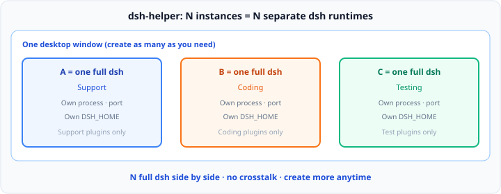

# dsh-helper User Guide

[中文](user-guide.zh-CN.md) · [Back to README](../README.en.md)

For people who already have an installer: install, multi-instance, and package import/export. UI labels match this guide.

## Contents

1. [Concepts](#concepts)
2. [Install](#install)
3. [First run](#first-run)
4. [Workspaces](#workspaces)
5. [Packages (.dshpack)](#packages-dshpack)
6. [Data, migrate, uninstall](#data-migrate-uninstall)
7. [Settings reference](#settings-reference)
8. [Troubleshooting](#troubleshooting)

---

## Concepts

| Term | Meaning |
|------|---------|
| **Instance** | **One full, separate dsh**: own process, port, and data (`DSH_HOME`) — not a tab inside a single dsh |
| **Runtime** | The Node.js + dsh version for that instance; downloaded to a local cache, then materialized into the instance |
| **Package (.dshpack)** | An export of a tuned instance; import restores an interactive workspace on the current OS |
| **Agent preset** | A full capability composition inside dsh (tools / persona); still managed in the instance’s dsh UI |

**One instance = one `DSH_HOME` = one fixed plugin set.** Split directed tasks across instances so they do not conflict in a single workspace. Plugin install and Agent presets stay in the **dsh web UI**; dsh-helper creates, runs, splits panes, and ships packages.

---

## Install

Installers are on [GitHub Releases](https://github.com/x102201/dsh-helper/releases). The version is embedded in the file name.

### System requirements

| Platform | Requirement |
|----------|-------------|
| Windows | 10+ (x64 / arm64) |
| macOS | 10.15+ |
| Linux | Mainstream distros (glibc + WebKit2GTK) |
| Disk | First run downloads runtime; reserve several GB for cache and instances |

### File name examples

| Platform | Example |
|----------|---------|
| Windows x64 | `dsh-helper_0.1.3_windows_x64-setup.exe` |
| Windows arm64 | `dsh-helper_0.1.3_windows_arm64-setup.exe` |
| macOS | `dsh-helper_0.1.3_macos_arm64.dmg` |
| Linux | `dsh-helper_0.1.3_linux_x64.deb` / `.AppImage` |

### Windows

1. Download the `-setup.exe` for your architecture from Releases
2. Run the installer
3. Launch **dsh-helper** from the Start menu or desktop shortcut

If SmartScreen says the app is blocked / from an unknown publisher: **More info** → **Run anyway** (builds from this repo’s Releases are not code-signed).

### macOS

1. Open the `.dmg` and drag **dsh-helper** into Applications
2. If macOS says the developer cannot be verified: right-click → **Open**, or allow under System Settings → Privacy & Security

Current builds are not signed or notarized with an Apple Developer certificate (expected without a paid developer account).

### Linux

- **Debian / Ubuntu**: `sudo dpkg -i dsh-helper_*_linux_x64.deb` (arm64 likewise)
- **AppImage**: `chmod +x dsh-helper_*.AppImage`, then run

The installer is small and does **not** ship full runtime binaries. The first use downloads Node.js and DeepSeek Harness from the runtime manifest.

---

## First run

On launch you get the **first-run wizard**:

1. **Welcome** — multi-instance and packages
2. **Data directory & instance** — root path, first instance name, runtime version
3. **Install & create** — download runtime and create the first instance

Default data directory: **`.dshHelper`** under your user home (Windows: `%USERPROFILE%\.dshHelper`). Environments, cache, imports, settings, and logs all live under that root.

When the wizard finishes, the first instance appears in the sidebar. Double-click to open its workbench.

---

## Workspaces

Create an instance for each directed task, and **install only that task’s plugins inside that instance’s dsh UI**.

### Basics

1. Sidebar → **New instance**
2. Start the instance if needed → **double-click to open the workbench** (or drag into the work area)
3. Drag a tab to a **window edge** to split; drop into another pane to **merge**
4. Drag tabs to window edges to split / merge freely (e.g. side-by-side, **2×2**, …)

### Startup phases

Progress shows in the sidebar or workbench:

1. Start process  
2. Initialize runtime (first launch of a version often takes **1–3 minutes** for dependencies)  
3. Wait until the port is ready  

Each instance has its own DeepSeek Harness process and port, and does not share a data directory.

Treat each instance as a **dedicated instance** (support / coding / testing). To advance them against **the same delivery**, run them **on one computer**, in one workspace, pointed at the **same project folder**. Plugins stay isolated, files are shared; dispatch from the split panes. One dsh per extra PC is one instance per machine — it costs hardware and hides the rest of the workspace.

### Stop and delete

- Closing a tab follows **Settings → when closing a tab** (stop instance / keep running)
- **Details** on an instance can delete it (irreversible; removes that instance’s data)

---

## Packages (.dshpack)

A `.dshpack` ships a **configured instance**, not a plugin shopping list. On import, dsh-helper restores the environment for the current platform (Node / dsh versions, patches, presets, settings, declared plugins). One package is one instance; configure several dedicated instances, export several packs. Import does not restore the split-pane layout.

### Importer

1. Sidebar → **Import package**, or double-click an associated `.dshpack`
2. Read the summary (runtime, plugin count, license mode, …)
3. Complete **trust confirmation** (patches and bundles may run code — only import sources you trust)
4. Finish license checks (password / machine code) and name the instance

Under **Settings → General** you can associate `.dshpack` files so double-click opens import.

### Author / exporter

1. Instance **Details** → **Export package**
2. **Step 1 · Contents**: environment spec is included automatically; sessions optional; **API keys / credentials are never exported**
3. **Step 2 · License & limits**: protection mode and limits

| Mode | Meaning |
|------|---------|
| Public share | No device/password gate; fine for tests |
| Bound device | Bind buyer machine code; only that device can import |
| Password | Password required to import |
| Device + password | Both; suited to formal delivery |

Optional limits:

- **Forbid re-export** — instances from this package cannot be exported again  
- **Imports per machine** — how many times one device may import  

Buyers copy their machine code from **Settings → About → Copy machine code** and send it to you.

### Boundaries

- There is no in-app store; payment and delivery are between you and the buyer
- One package is one instance; export each dedicated instance separately. Split-pane layout is not included
- Licensing limits misuse; password and machine binding are the main access controls
- Changing the motherboard changes the machine code; bound packages may need re-authorization
- VM clones that share board identity may share a machine code

---

## Data, migrate, uninstall

All user data lives under one root:

| Path | Contents |
|------|----------|
| `environments/` | Instance environments |
| `cache/` | Runtime download cache |
| `imports/` | Import staging and import ledger |
| `logs/` | Logs |
| `settings.json` | App settings |

**Settings → General** shows the path and offers **Change…** / **Migrate…**. Migration stops all instances first; do not force-quit during migration.

Uninstalling dsh-helper **does not** remove the data directory. Delete `.dshHelper` manually for a clean wipe.

---

## Settings reference

| Item | Where / notes |
|------|----------------|
| Appearance | Settings → General (light / dark / system); shell only, not pages inside instances |
| Associate .dshpack | Settings → General; double-click opens import |
| On closing main window | Stop all / ask / keep running (often with tray) |
| On closing a tab | Stop instance / keep running |
| Machine code | Settings → About → Copy machine code; for device-bound packages |
| Terminal | On a running instance; PATH / `DSH_HOME` apply to that session only |
| Data directory | Change or migrate the root |

---

## Troubleshooting

| Symptom | What to do |
|---------|------------|
| First start of a version is slow | Expected: dependency install often 1–3 minutes; later starts are faster |
| Start failed / unclean exit | Check instance Details logs; crash recovery reconciles leftover processes and ports |
| macOS “unidentified developer” | Right-click → Open, or allow in System Settings; see [Install · macOS](#macos) (unsigned / not notarized) |
| Windows SmartScreen / unknown publisher | **More info** → **Run anyway**; see [Install · Windows](#windows) |
| Machine code mismatch (E-20) | Confirm the export bound this device’s code; after a board change, re-authorize |
| Cannot export again (E-23) | Instance came from a forbid-re-export package; expected |
| Trust step blocked | You must confirm trust; only import packages you accept |
| Runtime damaged | Details → rebuild runtime from cache (keeps workspace and session data) |
| Large Linux AppImage | AppImages bundle deps; larger than `.deb` by design |

If you are still stuck, open a [GitHub Issue](https://github.com/x102201/dsh-helper/issues) or use **Settings → About → Feedback** in the app.
