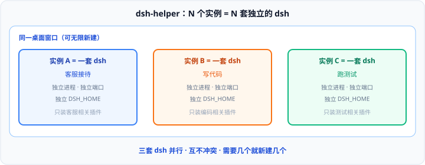

# dsh-helper 用户指南

[English](user-guide.en.md) · [返回首页](../README.md)

面向已下载安装包的用户：按任务完成安装、多开与制品导入导出。界面内按钮名与本文一致。

## 目录

1. [概念](#概念)
2. [安装](#安装)
3. [第一次启动](#第一次启动)
4. [工作间](#工作间)
5. [制品（.dshpack）](#制品dshpack)
6. [数据、迁移与卸载](#数据迁移与卸载)
7. [设置参考](#设置参考)
8. [排错](#排错)

---

## 概念

| 名词 | 含义 |
|------|------|
| **实例** | **一整套独立的 dsh**：自有进程、端口与数据目录（`DSH_HOME`），不是同一个 dsh 里的标签页 |
| **运行时** | 该实例使用的 Node.js + dsh 版本；由应用按清单下载到本机缓存，再物化到实例目录 |
| **制品（.dshpack）** | 把「已调好的实例」导出成的规格文件；导入后按当前系统复原出可交互的工作间 |
| **Agent 预设** | dsh 内一份完整能力组合（工具 / 人设等）；仍在实例内的 dsh 界面中管理 |

**一实例 = 一份独立 `DSH_HOME` = 一套固定插件。** 定向任务拆到不同实例，就不会在同一个工作空间里互相冲突。插件安装与 Agent 预设仍在 **dsh 网页界面** 中完成；dsh-helper 负责实例的创建、运行、分屏与制品分发。

---

## 安装

安装包发布在 [GitHub Releases](https://github.com/x102201/dsh-helper/releases)。版本号以安装包文件名为准。

### 系统要求

| 平台 | 要求 |
|------|------|
| Windows | 10 及以上（x64 / arm64） |
| macOS | 10.15 及以上 |
| Linux | 主流发行版（glibc + WebKit2GTK） |
| 磁盘 | 首次会下载运行时；建议为缓存与实例预留数 GB |

### 文件名示例

| 平台 | 示例 |
|------|------|
| Windows x64 | `dsh-helper_0.1.3_windows_x64-setup.exe` |
| Windows arm64 | `dsh-helper_0.1.3_windows_arm64-setup.exe` |
| macOS | `dsh-helper_0.1.3_macos_arm64.dmg` |
| Linux | `dsh-helper_0.1.3_linux_x64.deb` / `.AppImage` |

### Windows

1. 从 Releases 下载对应架构的 `-setup.exe`
2. 双击运行安装向导
3. 从开始菜单或桌面快捷方式启动 **dsh-helper**

若 SmartScreen 提示「已阻止」「未知发布者」：点 **更多信息** → **仍要运行**（安装包来自本仓库 Releases，当前未做代码签名）。

### macOS

1. 打开 `.dmg`，将 **dsh-helper** 拖入「应用程序」
2. 若提示「无法验证开发者」或无法打开：在 Finder 中右键应用 → **打开**，或到「系统设置 → 隐私与安全性」点允许

当前构建未使用 Apple 开发者证书签名/公证（无个人开发者账户时属预期）。

### Linux

- **Debian / Ubuntu**：`sudo dpkg -i dsh-helper_*_linux_x64.deb`（arm64 同理）
- **AppImage**：`chmod +x dsh-helper_*.AppImage` 后运行

安装包体积较小，**不含**完整运行时二进制；第一次使用会按清单下载 Node.js 与 DeepSeek Harness。

---

## 第一次启动

启动后进入**首次运行向导**，大致顺序：

1. **欢迎** — 说明多开与制品能力
2. **数据目录与实例** — 选择数据根目录、命名首个实例、选定运行时版本
3. **安装并创建** — 下载运行环境并创建首个实例

默认数据目录为用户目录下的 **`.dshHelper`**（Windows：`%USERPROFILE%\.dshHelper`）。环境、缓存、导入、设置与日志都在此根目录下。

向导结束后，侧栏会出现第一个实例。按提示双击打开工作台。

---

## 工作间

核心操作：为某个定向任务新建实例，**只在该实例的 dsh 界面里安装这一任务需要的插件**。

### 基本流程

1. 侧栏点击 **新建实例**
2. 侧栏对实例：启动（未运行时）→ **双击打开工作台**（或拖入工作区）
3. 将标签拖到窗口**边缘**可分割窗格；拖入另一窗格可**合并**
4. 将标签拖到窗口边缘可自由分屏 / 合并（常见如左右对开、**2×2** 等）

### 启动阶段

侧栏或工作台会显示进度，常见三步：

1. 启动进程  
2. 初始化运行环境（某版本**首次**启动常需 1–3 分钟安装依赖）  
3. 等待端口就绪  

每个实例拥有独立的 DeepSeek Harness 进程与端口，互不共享数据目录。

每个实例是一个**专职实例**（客服 / 开发 / 测试）。要在同一份交付上并行：在**同一台电脑**的工作区里运行，打开**同一个项目目录**。插件仍隔离，文件共享；在分屏中调度。拆到多台电脑等于一台机器一个实例，既增加硬件，也无法在同一工作区查看。

### 停止与删除

- 关闭标签的行为由设置「关闭标签时」决定（停止实例 / 保持运行）
- 在实例 **详情** 中可删除实例（不可撤销，会清除该实例数据）

---

## 制品（.dshpack）

`.dshpack` 交付的是「已配置好的实例」，不是插件清单。导入时本产品按规格在当前平台复原运行环境（Node / dsh 版本、补丁、预设、设置与声明的插件）。一份制品对应一个实例；配置好几个专职实例，就分别导出几个包。导入不会复原分屏布局。

### 我是使用者：导入

1. 侧栏 **导入制品**，或双击已关联的 `.dshpack` 文件
2. 阅读包摘要（运行环境、插件数、授权方式等）
3. 完成 **信任确认**（配置补丁与 Bundle 可能执行代码，只导入你信任的来源）
4. 按提示完成授权校验（密码 / 机器码）与实例命名

可在 **设置 → 通用** 中开启「关联 .dshpack 文件」，便于双击打开导入流程。

### 我是作者：导出

1. 打开实例 **详情** → **导出制品**
2. **第 1 步 · 导出内容**：环境规格自动包含；可勾选会话等；**API Key / 凭据永不导出**
3. **第 2 步 · 授权与使用限制**：选择保护方式与限制

| 保护方式 | 说明 |
|----------|------|
| 公开分享 | 无设备/密码限制，适合测试与内部试用 |
| 仅指定设备 | 绑定买家机器码，仅该设备可导入 |
| 密码保护 | 导入需密码 |
| 设备 + 密码 | 双重保护，适合正式交付 |

可选限制：

- **禁止再次导出** — 从该制品创建的实例不可再导出为制品  
- **每台机器导入次数** — 限制同一设备能导入几次  

买家的机器码在其本机 **设置 → 关于 → 复制机器码** 获取后发给你。

### 能力边界

- 目前没有应用内商店；付费与交付发生在你与买家之间
- 一份制品对应一个实例；多个专职实例需分别导出，分屏布局不进入制品
- 授权用于防误用与限定范围；密码与机器码绑定是主要访问控制
- 更换主板后机器码会变，已绑定包可能需作者重新授权
- 虚拟机克隆若共享主板标识，机器码可能相同

---

## 数据、迁移与卸载

所有用户数据集中在一个根目录，常见子目录：

| 路径 | 内容 |
|------|------|
| `environments/` | 各实例环境 |
| `cache/` | 运行时下载缓存 |
| `imports/` | 导入暂存与导入台账 |
| `logs/` | 日志 |
| `settings.json` | 应用设置 |

在 **设置 → 通用** 可查看路径，并使用 **更改…** / **迁移…**。迁移会先停止全部实例；过程中请勿强制结束应用。

卸载 dsh-helper **不会自动删除**数据目录。若需彻底清理，卸载后手动删除 `.dshHelper` 文件夹。

---

## 设置参考

| 项 | 位置 / 说明 |
|----|-------------|
| 外观 | 设置 → 通用 → 外观（浅色 / 深色 / 跟随系统）；仅影响 dsh-helper 壳，不影响实例内 dsh 页面 |
| 关联 .dshpack | 设置 → 通用；双击制品进入导入 |
| 关闭主窗口时 | 停止全部实例 / 每次询问 / 保持运行（常配合托盘） |
| 关闭标签时 | 停止实例 / 保持运行 |
| 机器码 | 设置 → 关于 → 复制机器码；用于制品设备绑定 |
| 终端 | 运行中实例可打开系统终端；PATH / `DSH_HOME` 仅本会话生效 |
| 数据目录 | 更改或迁移根目录 |

---

## 排错

| 症状 | 处理 |
|------|------|
| 某版本首次启动很慢 | 正常：实例内安装依赖常需 1–3 分钟；后续会快很多 |
| 启动失败 / 上次异常退出 | 查看实例详情日志；应用会做崩溃恢复（校正残留进程与端口） |
| macOS「无法验证开发者」 | 右键 → 打开，或系统设置里允许；见 [安装 · macOS](#macos)（未签名/未公证） |
| Windows SmartScreen / 未知发布者 | **更多信息** → **仍要运行**；见 [安装 · Windows](#windows) |
| 导入提示机器码不符（E-20） | 确认导出时绑定的是当前设备码；换主板后需重新授权 |
| 无法再导出（E-23） | 该实例来自「禁止再次导出」的制品，属预期 |
| 导入信任步骤无法继续 | 必须勾选信任来源；只导入你确认安全的包 |
| 运行时损坏 | 实例详情中可「从缓存重建运行时」（保留工作区与会话数据） |
| Linux AppImage 体积大 | AppImage 自带依赖，大于 `.deb` 属正常 |

仍无法解决时，可到 [GitHub Issues](https://github.com/x102201/dsh-helper/issues) 反馈，或在应用内 **设置 → 关于 → 反馈**。
